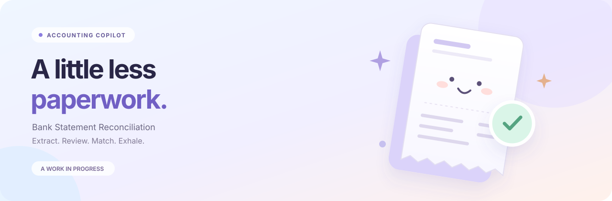

<div align="center">



### Bank Statement Reconciliation

Your receipts, statements and supporting documents. One place to make sense of them.

**[Get started](#get-started)** &nbsp;·&nbsp; **[How it works](#how-it-works)** &nbsp;·&nbsp; **[Documentation](docs/README.md)**

`Python` &nbsp; `FastAPI` &nbsp; `Vue 3` &nbsp; `Docker`

</div>

> 🌱 **Growing into something shareable.**
> Currently hard-coded; open source soon! Bank extraction currently targets AmBank statements.

## Small steps. Clear records.

📄 **Read the paperwork.** Extract receipts, invoices and supporting files. Group exact duplicates automatically.

🔎 **Check the details.** Review entries beside the originals, then inspect suggested matches.

✅ **Make the call.** Accept or reject evidence. Your decisions are saved; originals stay intact.

📦 **Take it with you.** Export bank workbooks and supporting-document ZIPs.

<a id="how-it-works"></a>
## How it works

**Documents → Extraction → Your review → Matching → Export**

Run supporting documents, check their entries, then extract the bank statement. On the bank page, choose **Load for final matching**, then **Generate matches**. Review the proposed evidence before accepting it.

AI extraction and matching use Codex through your ChatGPT subscription login. Suggestions always need your review.

<a id="get-started"></a>
## 🚀 Get started

You need **Docker Compose** and **a ChatGPT account with Codex access**.

**01 · Add your files**

Copy `.env.example` to `.env`. Add your project folders inside `uploads/`:

```text
uploads/
  MyProject/
    statement/
      bank-statement.pdf    # One statement PDF
    documents/
      invoice.pdf
      receipts/
```

Docker mounts this folder at `/uploads`. Its contents are ignored by Git and excluded from Docker images. To use another folder, set `UPLOADS_PATH` and `DOCUMENTS_PATH` in `.env`; use forward slashes on Windows.

**02 · Start your workspace**

```console
docker compose --project-directory . -f docker/compose.yaml build
docker compose --project-directory . -f docker/compose.yaml run --rm dashboard codex login
docker compose --project-directory . -f docker/compose.yaml up -d
```

Choose ChatGPT login. Open **[localhost:8765](http://localhost:8765)**, then **Bank Statement Reconciliation → New project**. Select `/uploads/MyProject`. Use **Resume** to pick up where you left off.

## 🌱 Up next

- [ ] Remove hard-coded project assumptions.
- [ ] Make setup reusable across workspaces.
- [ ] Prepare the open-source release.

<details>
<summary><strong>🗂️ Project map</strong></summary>

```text
bank-statement-reconcilation/
├── src/
│   ├── dashboard/             # FastAPI + Vue
│   │   ├── api/
│   │   ├── services/
│   │   └── frontend/src/
│   │       ├── features/      # projects, extraction, bank, matching, export
│   │       ├── components/    # Shared UI
│   │       └── styles/        # Shared theme
│   └── reconciliation/        # Python workflow and matching rules
├── resources/                 # Prompts and configuration
├── tests/                     # Unit tests, browser checks and fixtures
├── docs/                      # Guides, roadmap and historical archive
├── scripts/                   # Benchmarks and maintenance
└── docker/                    # Container build
```

</details>

<details>
<summary><strong>For developers</strong></summary>

For local Python development, run `python -m pip install -e .` first. Docker sets the source path automatically.

```console
# Rebuild
docker compose --project-directory . -f docker/compose.yaml up -d --build dashboard

# Test
docker compose --project-directory . -f docker/compose.yaml exec dashboard python -m unittest discover -s tests/unit -t .

# Logs
docker compose --project-directory . -f docker/compose.yaml logs --tail 50 dashboard

# Stop
docker compose --project-directory . -f docker/compose.yaml down
```

The app binds to localhost by default. Keep the `codex-home` volume and project review data when updating.

[Architecture](docs/ARCHITECTURE.md) · [Tests](tests/README.md) · [Matching rules](docs/workflow/FINAL_COMPARISON.md) · [Token usage](docs/operations/TOKEN_ACCOUNTING.md)

</details>
