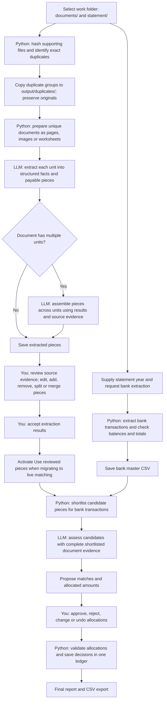
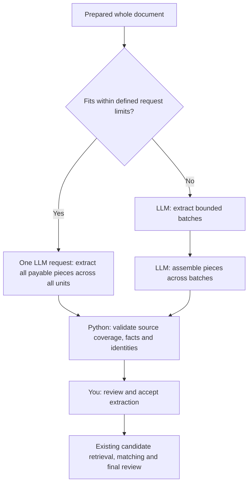

# Extraction and reconciliation flow - review draft

Date: 20 September 2026

This document separates the current implementation from the proposed extraction simplification. Whole-document extraction and batch assembly below are proposals, not implemented changes.

## 1. Current full flow

Accepting extraction means the document facts were reviewed. Approving a match is a separate decision about support for a bank transaction.

## 2. Where the LLM is used

| Stage | Input | Output | When |
| --- | --- | --- | --- |
| Extraction | Page/image evidence or prepared worksheet/text | Document context and payable pieces | Each prepared unit |
| Receipt assembly | All unit results plus source evidence from the same document | Pieces with source-unit coverage and uncertain-boundary flags | Documents with two or more units |
| Matching | Bank transactions, shortlisted pieces and their complete parent-document evidence | Proposed allocations and reasons | When Generate matches runs |

The default workflow model is `gpt-5.6-sol`, through `codex exec` using the existing ChatGPT subscription login. Model output is structured and validated. Images accompany vision requests.

Python handles hashing, exact duplicates, file preparation, bank extraction, candidate retrieval, arithmetic, validation, identities, saved state and usage records. It does not grant human approval.

## 3. Fields extracted now

### Document context

| Field | Purpose |
| --- | --- |
| Readable | Whether key supplied content can reliably be read |
| Summary | Short document context |
| Labelled totals | Explicit total label, amount, currency and source location |

Document-level `document_type` and document/piece `limitations` have been removed from the active extraction and assembly schemas. Existing saved results remain compatible. Long-running application processes need to reload the schemas before using the change.

### Each payable piece

| Field | Purpose |
| --- | --- |
| Piece type | Receipt, invoice, claim, recipient row, etc. |
| Payee | Explicitly identified recipient, employee or merchant |
| Description | What the expense or payment relates to |
| References | Typed invoice, receipt, claim, payment or other identifiers |
| Dates | Typed invoice date, payment date, claim period or other date |
| Amount | Supported payable total |
| Currency | Explicit currency when supported |
| Amount basis | Meaning of the amount, such as invoice total or net salary |
| Source locations | Page, image region, row or cell |

Assembly also records reviewed source units, each piece's source units and whether its boundaries need review. Python assigns piece identities; the model does not assign approvals.

Unknown facts stay empty. Purchase line items, taxes and subtotals within one receipt do not become separate payable pieces. Document totals provide context and do not add payable capacity.

## 4. Why assembly currently exists

Extraction reads individual units. Assembly determines how their results belong together within one source file.

| Example | Intended assembled result |
| --- | --- |
| One invoice spanning three pages | One piece with all relevant source pages; count its total once |
| Three separate receipts in one PDF | Three pieces |
| The same receipt repeated within a file | Avoid treating the repeated evidence as another expense |
| A payment schedule with several recipients | Keep each separately payable recipient as a piece |
| Unclear continuation or receipt boundaries | Flag for human review |

Single-unit documents already skip assembly. Assembly is an LLM judgment and can be wrong; Python validates coverage and source references, while human review resolves uncertain boundaries.

The current assembly path leaves oversized requests unresolved when they exceed its image or prompt limit. It does not yet implement the batch fallback proposed below.

## 5. Proposed simplification - for review

Read a whole supporting document in one extraction request whenever it fits. That request identifies pieces across all pages, so a separate assembly call is unnecessary for those documents.

| Area | Current | Proposed |
| --- | --- | --- |
| Single-unit document | Extraction only | Extraction only |
| Multi-unit document that fits | Per-unit extraction plus assembly | One whole-document extraction request |
| Oversized document | Assembly can remain unresolved | Bounded extraction batches plus assembly fallback |
| Human extraction review | Required for acceptance | Retained |
| Bank extraction and matching | Existing flow | Retained |

Expected benefit: fewer model requests and less repeated output for ordinary multi-page documents. Actual token cost, speed and accuracy must be measured; a larger request is not automatically cheaper or more accurate.

Simply removing assembly while retaining independent page extraction risks splitting one invoice into multiple pieces or counting repeated totals more than once.

## 6. Review decisions before implementation

- Adopt whole-document extraction for documents that fit?
- Keep assembly only for documents requiring batches?
- Define request limits using image count, image size and text/context size.
- Require complete source-unit coverage in whole-document output.
- Compare current and proposed results on multi-page invoices, multiple receipts, payout schedules and repeated pages before rollout.

No extraction or matching model runs were started to prepare this document. The proposed simplification has not been implemented.

## 7. State, failures and evidence

- Preserve original inputs and original supporting-document locations.
- Keep incomplete, failed and unreadable results unresolved; preserve checkpoints for resume.
- Record usage for every workflow model attempt, by stage and model. Cache hits have zero new usage; unreported usage stays unknown.
- Bind approvals and match suggestions to current evidence. Editing evidence can require fresh review.
- Keep final decisions in `final-review/decisions.json`; models only propose allocations.
- Live matching migration preserves historical decisions and marks stale evidence for review.

## Implementation references

- [Extraction prompt](../prompts/extraction.md) and [schema](../prompts/extraction.schema.json)
- [Assembly prompt](../prompts/receipt_assembly.md) and [schema](../prompts/receipt_assembly.schema.json)
- [Extraction and assembly orchestration](../reconciliation/vision_workflow.py)
- [Live piece pipeline review](PIECE_PIPELINE_REVIEW.md)
- [Candidate retrieval rules](MATCHING_RETRIEVAL.md)
- [Final comparison and migration rules](FINAL_COMPARISON.md)

The older [workflow snapshot](WORKFLOW.md) predates the live matching integration. Its frozen-only matching limitation is superseded by the live pipeline section of FINAL_COMPARISON.md.

## Removed-field dependency review

The extraction editor no longer offers Limitations. Its former Document type label is now Piece type: that control always described an individual payable piece, which remains part of the extraction contract.

New matching model requests omit document/piece limitations. Supporting-inventory CSV exports omit the document-level document_type and limitations columns; nested receipts use piece_type and omit limitations. Consumers of those CSV columns must update their mappings. Final bank-match report columns are unchanged.

Historical extraction JSON, receipt adapters and approval fingerprints retain their old fields for compatibility. Existing evidence and decisions are not rewritten merely to remove a field. Legacy duplicate-comparison assessments have their own limitations field and remain separate from extraction.

The experimental PDF router previously depended on document classification and limitations. It now checks piece type, readability, source-backed values and totals. Historical uncertainty notes still trigger conservative visual fallback. Text/vision disagreements produce a Python-generated review warning, visible in extraction review and excluded from untouched bulk acceptance. This is a processing warning, not a new free-form model extraction field.

Removing model limitations loses the model's written explanation of ambiguity. Missing or conflicting facts stay blank; unreadable results, assembly boundary flags and system warnings still require attention. Checking the original remains part of human review.

### Verification after downstream cleanup

- Frontend production build passed.
- 73 focused Python and browser tests passed, covering extraction, assembly, legacy adapters, PDF routing and warnings, matching payloads, inventory exports, editing, save/reload, split/merge, mobile matching and final reports.
- Desktop and mobile screenshots were inspected; the removed controls are absent. Screenshots are local QA artifacts under `.tools/field-removal/`.
- Broader help/navigation checks exposed two failures: missing Bank-page help in one fixture and workspace resume blocked by a missing review configuration. Concurrent changes exist in those areas; they were not altered as part of this cleanup.
- The browser walkthrough used isolated fixtures and the updated build. No live extraction or matching calls were started, and no real approvals were changed. The live service was not restarted because it would also load concurrent workspace changes outside this review.
