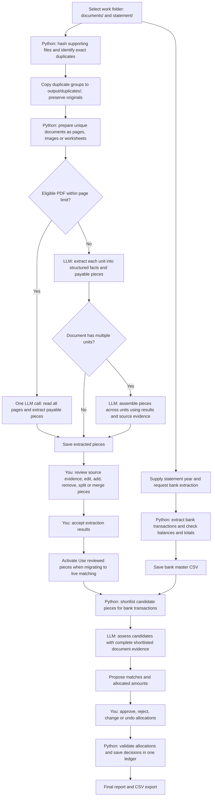

# Extraction and reconciliation flow - review draft

Date: 20 September 2026

Whole-document PDF extraction is implemented with a configurable page limit, defaulting to 5. Longer PDFs retain page extraction plus assembly. The diagrams below describe the implemented flow.

## 1. Current full flow

Accepting extraction means the document facts were reviewed. Approving a match is a separate decision about support for a bank transaction.

## 2. Where the LLM is used

| Stage | Input | Output | When |
| --- | --- | --- | --- |
| Whole-PDF extraction | All PDF units and their prepared images/text | Document context, pieces and complete source coverage | Eligible new or regenerated PDFs up to the configured limit |
| Per-unit extraction | Page/image evidence or prepared worksheet/text | Document context and payable pieces | Longer PDFs, fallback routes and other document units |
| Receipt assembly | All unit results plus source evidence from the same document | Pieces with source-unit coverage and uncertain-boundary flags | Multi-unit documents using per-unit extraction |
| Matching | Bank transactions, shortlisted pieces and their complete parent-document evidence | Proposed allocations and reasons | When Generate matches runs |

The default workflow model is `gpt-5.6-sol`, through `codex exec` using the existing ChatGPT subscription login. Model output is structured and validated. Images accompany vision requests.

Python handles hashing, exact duplicates, file preparation, bank extraction, candidate retrieval, arithmetic, validation, identities, saved state and usage records. It does not grant human approval.

## 3. Fields extracted now

### Document context

| Field | Purpose |
| --- | --- |
| Readable | Whether key supplied content can reliably be read |
| Summary | Short document context |
| Labelled totals | Explicit total label, amount, currency and source location |

Document-level `document_type` and document/piece `limitations` have been removed from the active extraction and assembly schemas. Existing saved results remain compatible. Long-running application processes need to reload the schemas before using the change.

### Each payable piece

| Field | Purpose |
| --- | --- |
| Piece type | Receipt, invoice, claim, recipient row, etc. |
| Payee | Explicitly identified recipient, employee or merchant |
| Description | What the expense or payment relates to |
| References | Typed invoice, receipt, claim, payment or other identifiers |
| Dates | Typed invoice date, payment date, claim period or other date |
| Amount | Supported payable total |
| Currency | Explicit currency code, such as MYR, USD, SGD or EUR; blank when unknown |
| Amount basis | Meaning of the amount, such as invoice total or net salary |
| Source locations | Page, image region, row or cell |

Whole-document extraction and assembly both record reviewed source units, each piece's source units and whether its boundaries need review. Python assigns piece identities; the model does not assign approvals.

Python normalizes RM to MYR in new extraction results, accepted edits and read-only displays/comparisons. Other currency codes remain allowed, and amounts are never converted. No MYR-only prompt or schema restriction is used. Historical saved evidence is not rewritten automatically. Unknown facts stay empty. Purchase line items, taxes and subtotals within one receipt do not become separate payable pieces. Document totals provide context and do not add payable capacity.

## 4. Why assembly currently exists

When extraction reads individual units, assembly determines how their results belong together within one source file. Whole-document PDF extraction establishes those boundaries in its first and only call.

| Example | Intended assembled result |
| --- | --- |
| One invoice spanning three pages | One piece with all relevant source pages; count its total once |
| Three separate receipts in one PDF | Three pieces |
| The same receipt repeated within a file | Avoid treating the repeated evidence as another expense |
| A payment schedule with several recipients | Keep each separately payable recipient as a piece |
| Unclear continuation or receipt boundaries | Flag for human review |

Single-unit documents and eligible whole-document PDFs skip the separate assembly call. Assembly is an LLM judgment and can be wrong; Python validates coverage and source references, while human review resolves uncertain boundaries.

The current assembly path leaves oversized requests unresolved when they exceed its image or prompt limit. Grouping long PDFs into intermediate multi-page batches remains future work.

## 5. Configurable whole-document PDF extraction

Settings > Documents > **Whole-document PDF page limit** controls `pdf_whole_document_max_pages`.

- Default: **5 pages**. Allowed values: **1-40**.
- At or below the limit: one extraction call with all prepared page evidence and complete source coverage.
- Above the limit: one call per prepared unit, then one assembly call.
- Set 1 to keep multi-page PDFs on the page-by-page route.
- The count uses actual page labels, not the number of text chunks.
- Experimental hybrid/compare modes remain page-based to preserve their individual-page audits.
- Requests exceeding 40 prepared images or 100,000 prompt characters fall back to the existing per-unit route. Inputs are never silently truncated.
- PDF processing mode and the picture switch still determine whether prepared evidence contains images or text. Blocked pages remain unresolved.

| Example with default limit | Extraction calls | Separate assembly call |
| --- | --- | --- |
| One-page PDF | 1 | No |
| Three-page PDF | 1 | No |
| Five-page PDF | 1 | No |
| Six-page PDF | 6 for ordinary one-unit pages | Yes |
| Six-page PDF with limit changed to 6 | 1 | No |

## 6. Resume, review and usage

Changing the limit does not clear existing results or invalidate approvals. It applies to unread PDFs and explicit regeneration. Partially extracted PDFs finish their existing per-unit route, preserving successful calls. A threshold change during processing stops subsequent requests; run again to resume.

Whole-document results use the existing document review record, including source units and boundary flags, without a second model call. Compatibility page records assign each piece to its first supporting unit and retain document context once, avoiding duplicate amounts in inventory exports. Review and matching use the complete document result.

Successful whole-document results are checkpointed together. Invalid coverage or failed model calls publish no new partial document result; failures remain unresolved. Whole-document attempts use the `pdf_document` usage stage and the configured PDF model through the existing Codex runner, including cache and token accounting.

Request-count and integration checks use simulated structured responses, with no live model calls. They verify orchestration, source coverage, resume, regeneration and nonduplication; they do not establish extraction accuracy on real customer PDFs. Token cost and accuracy still need real-data measurement.

## 7. State, failures and evidence

- Preserve original inputs and original supporting-document locations.
- Keep incomplete, failed and unreadable results unresolved; preserve checkpoints for resume.
- Record usage for every workflow model attempt, by stage and model. Cache hits have zero new usage; unreported usage stays unknown.
- Bind approvals and match suggestions to current evidence. Editing evidence can require fresh review.
- Keep final decisions in `final-review/decisions.json`; models only propose allocations.
- Live matching migration preserves historical decisions and marks stale evidence for review.

## Implementation references

- [Extraction prompt](../prompts/extraction.md) and [schema](../prompts/extraction.schema.json)
- [Whole-PDF prompt](../prompts/pdf_document.md) and [routing/checkpoint implementation](../reconciliation/pdf_document.py)
- [Assembly prompt](../prompts/receipt_assembly.md) and [schema](../prompts/receipt_assembly.schema.json)
- [Extraction and assembly orchestration](../reconciliation/vision_workflow.py)
- [Live piece pipeline review](PIECE_PIPELINE_REVIEW.md)
- [Candidate retrieval rules](MATCHING_RETRIEVAL.md)
- [Final comparison and migration rules](FINAL_COMPARISON.md)

The older [workflow snapshot](WORKFLOW.md) predates the live matching integration. Its frozen-only matching limitation is superseded by the live pipeline section of FINAL_COMPARISON.md.

## Removed-field dependency review

The extraction editor no longer offers Limitations. Its former Document type label is now Piece type: that control always described an individual payable piece, which remains part of the extraction contract.

New matching model requests omit document/piece limitations. Supporting-inventory CSV exports omit the document-level document_type and limitations columns; nested receipts use piece_type and omit limitations. Consumers of those CSV columns must update their mappings. Final bank-match report columns are unchanged.

Historical extraction JSON, receipt adapters and approval fingerprints retain their old fields for compatibility. Existing evidence and decisions are not rewritten merely to remove a field. Legacy duplicate-comparison assessments have their own limitations field and remain separate from extraction.

The experimental PDF router previously depended on document classification and limitations. It now checks piece type, readability, source-backed values and totals. Historical uncertainty notes still trigger conservative visual fallback. Text/vision disagreements produce a Python-generated review warning, visible in extraction review and excluded from untouched bulk acceptance. This is a processing warning, not a new free-form model extraction field.

Removing model limitations loses the model's written explanation of ambiguity. Missing or conflicting facts stay blank; unreadable results, assembly boundary flags and system warnings still require attention. Checking the original remains part of human review.

### Verification and activation

- 121 focused Python tests passed, including call counts at/above the PDF threshold, coverage validation, failed-call retry, regeneration with worker refill, partial resume, RM/MYR matching, foreign-currency acceptance and preservation of historical approvals.
- Eight browser tests passed against the production build: page-limit save/reload, whole-PDF review and acceptance, currency editing, split/merge, matching, final reports and page help on desktop/mobile. The final settings/preview walkthrough was repeated after correcting request-limit helper copy.
- Settings and review screenshots were inspected under `.tools/pdf-page-limit/`. Long help now scrolls without covering its button.
- The live dashboard was activated only after extraction, regeneration and matching were idle. Read-only checks confirmed the default PDF limit is 5 and currency remains editable. No live model requests or real approval changes were made.
- Existing extraction results remain intact. Use regeneration explicitly to apply whole-document extraction to a previously processed PDF.
