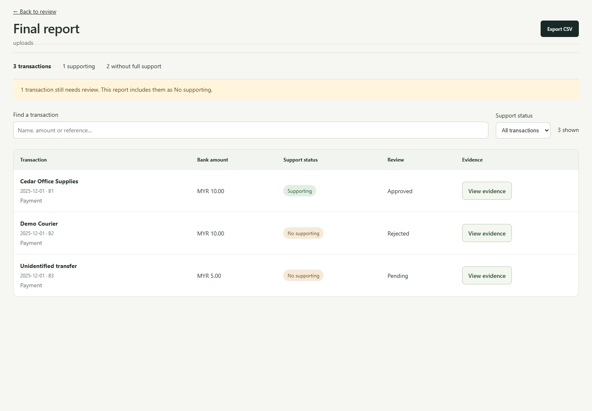
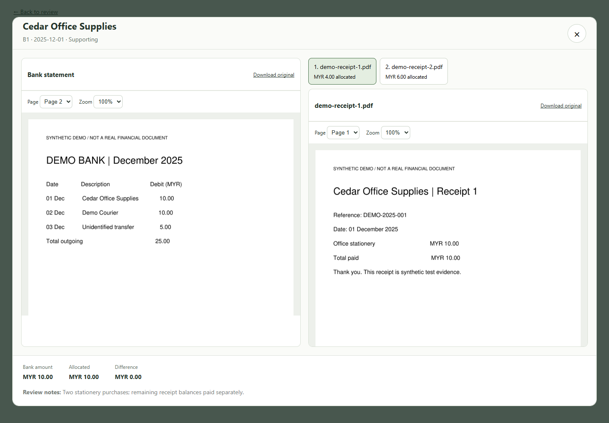
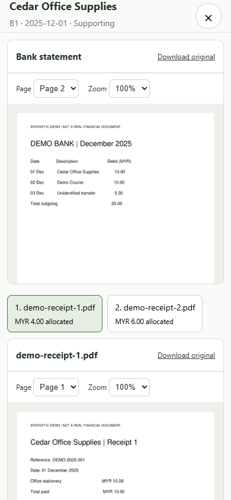
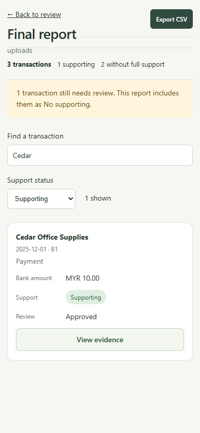
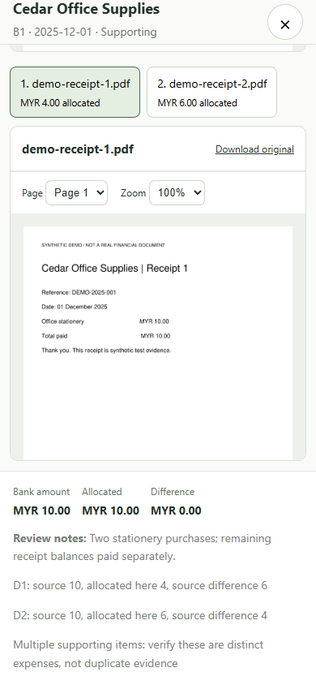

# Final report UI review

Captured with Playwright and local Chrome using isolated synthetic bank PDFs, receipts and saved decisions. No real customer data or LLM calls were used. Desktop: 1440 × 1000; mobile: 390 × 844.

## 1. Final report — passed

Every transaction remains visible, including pending and rejected entries. Support status and review decisions are distinct. Search, support filtering and CSV export work. Pending review has a visible notice.

## 2. Evidence popup — passed

The bank statement opens on its recorded source page. Approved receipt switches show individual allocations. Original download names are preserved. Zoom and page controls work; the popup shows totals and saved notes. Keyboard Tab stays within the popup, Escape closes it, and focus returns to the originating button. Filters remain unchanged. Viewing and downloading leave ledger bytes unchanged.

## 3. Mobile popup — passed, with scrolling

The pane fills the screen and stacks bank and supporting evidence. Close remains visible while scrolling. There is no horizontal popup overflow. Small original document text requires zoom; the preview provides 100–200% zoom and its own scroll area.

## 4. Mobile report — passed

Transaction cards keep View evidence visible without sideways scrolling. Closing the popup preserves the selected search and support filter.

## 5. Mobile notes and differences — passed

Scrolling reveals bank amount, allocated amount, difference, review notes and source-allocation flags. Notes wrap within the viewport.

## Checks and limits

- 14 targeted tests passed: 11 matching unit checks, the existing matching browser flow and two new report browser tests.
- Missing snapshots show an error with Retry and no export link. Changed originals downgrade support and refuse the affected preview. Pending and rejected proposals never appear as approved evidence.
- Fixed during this pass: ambiguous filter label, small default evidence buttons, mobile table overflow, original download naming and keyboard focus escaping the popup.
- This run validates synthetic PDF evidence. The existing Office/text renderers are reused but were not visually audited here. Screen-reader behavior and full accessibility compliance were not assessed.
- The active real workspace still requires its valid matching snapshot. Synthetic success does not establish that real pairings are ready.
- The final report reflects current saved decisions; it is not a frozen signed-off archive.

Reproduce screenshots with `FINAL_REPORT_SCREENSHOTS` set to a local directory and run `python -m unittest tests.browser.test_final_report` after building the frontend. The test suite uses temporary source files and an isolated review ledger.
