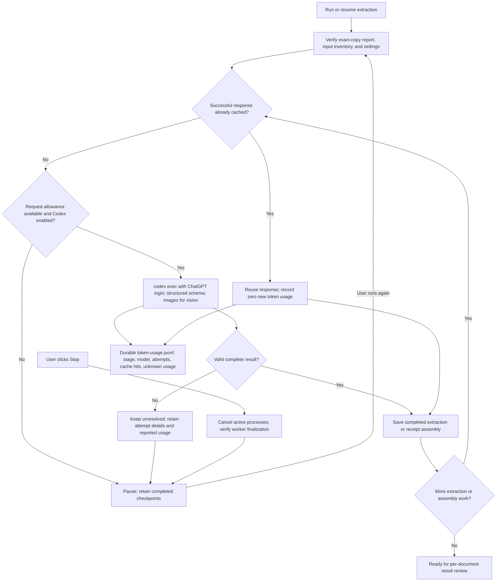
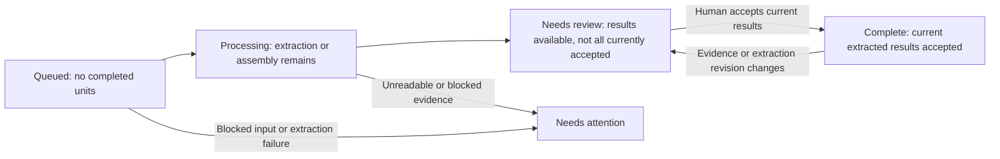
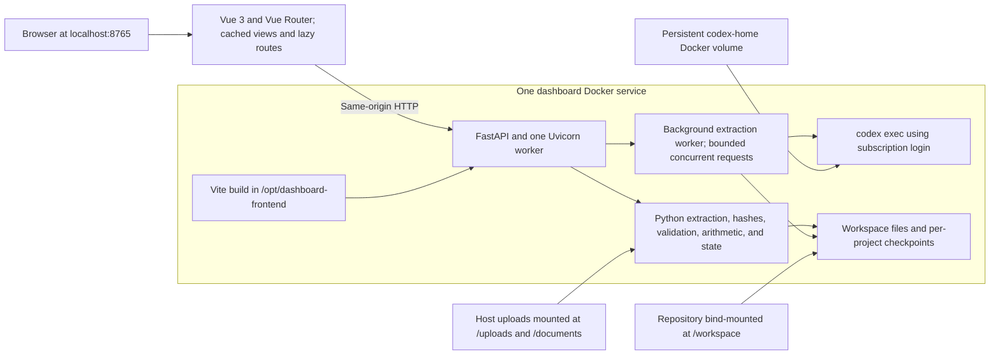
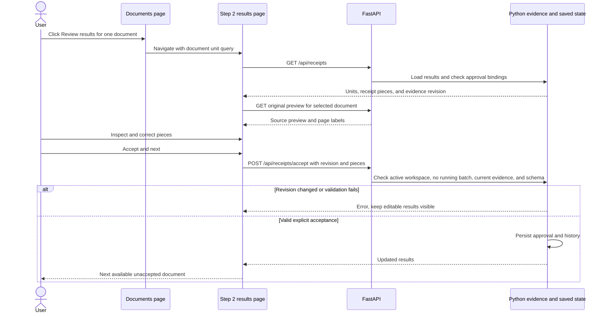

# Application workflow

Updated 18 September 2026, based on committed application revision `14659d1`. This describes the implemented Docker application, including its current matching limitation. Concurrent uncommitted feature work is outside this snapshot. Read this before the older duplicate-comparison examples in the root README.

## 1. Complete user journey

Solid arrows are implemented transitions or processing. Dotted arrows identify the intended connection that still needs an import implementation.

```mermaid
flowchart TD
    A["01 Get Started /source"] --> B["Choose workspace containing documents/ and statement/"]
    B --> C{"Both inputs valid?"}
    C -->|No| D["Show folder or statement error; correct selection"]
    D --> B
    C -->|Yes| E["Python hashes supporting files with SHA-256; show preview"]
    E --> F["User clicks Proceed"]
    F --> G{"Inputs still match preview?"}
    G -->|No| E
    G -->|Yes| H["Copy exact duplicate groups into output/duplicates/; write report.json"]
    H --> I["Preserve all originals; activate isolated project manifest"]
    I --> J["02 Documents /documents; skip duplicate-report screen"]
    J --> K["User clicks Run all documents"]
    K --> L["Prepare unique document inventory and page or sheet units"]
    L --> M["Codex extracts structured facts and receipt pieces"]
    M --> N{"Multiple units in a document?"}
    N -->|Yes| O["Assemble receipt boundaries across source pages"]
    N -->|No| P["Save extraction checkpoint and usage"]
    O --> P
    P --> Q["Extraction ends; no vision duplicate screening or comparison"]
    Q --> R["Each document has Review results"]
    R --> S["Step 2 result page: original evidence beside editable receipt pieces"]
    S --> T["Check totals, currency, references, locations, and receipt boundaries"]
    T --> U{"Accept this extraction?"}
    U -->|Edit further| T
    U -->|Accept and next| V["Validate evidence revision; persist human approval"]
    V --> W{"More unaccepted results?"}
    W -->|Yes| S
    W -->|No| X["Document results reviewed"]

    I --> BA["Bank statement /bank"]
    BA --> BB["User supplies statement year and requests extraction"]
    BB --> BC["Python extracts transactions and validates balances"]
    BC --> BD["Save bank-output/master_statement.csv"]
    BD --> BE["Browse transactions; optionally export bank-only workbook"]

    X -.-> IMP["New-workspace matching import still required"]
    BD -.-> IMP
    CACHE["Existing authorized frozen matching snapshot"] --> MATCH["Final review /matching"]
    IMP -.-> MATCH
    MATCH --> VALID{"Snapshot belongs to workspace and evidence is current?"}
    VALID -->|No| BLOCK["Show blocker; do not inherit unrelated approvals"]
    VALID -->|Yes| REVIEW["Review bank rows, candidates, originals, and remaining balances"]
    REVIEW --> DECIDE["Human approves, denies, changes, or undoes allocations"]
    DECIDE --> LEDGER["Save revision-bound final-review/decisions.json and history"]
    LEDGER --> REVIEW
    LEDGER --> EXPORT["Export all bank rows as CSV with support status and differences"]
```

**Current matching limitation:** `/matching` reads the authorized `duplicated/benchmarks/full-statement-240` snapshot. It does not automatically consume a newly extracted workspace or newly accepted receipt results. It checks the manifest and original bank-master hash and rejects mismatches. The dotted connection above is pending work, not an automatic step. See [FINAL_COMPARISON.md](FINAL_COMPARISON.md).

## 2. Extraction, failures, stop, and resume

- Extraction and receipt assembly retain their existing structured-output validation and request limits.
- A stopped, failed, blocked, or unreadable item is not silently accepted.
- Missing usage remains **unknown**; partial totals are not complete totals.
- Progress percentages report completed units in the current stage. Animation smooths measured updates; it does not invent completed work.
- Multi-page receipt assembly is part of extraction. It is not the removed vision duplicate pass.

## 3. Step 2 statuses and review actions

| Control | Behavior |
| --- | --- |
| Run all documents | Prepare if needed, then start or resume extraction and assembly. Does not run vision duplicate checks. |
| Stop | Request cancellation and retain completed work. Running remains true until worker/process shutdown is confirmed. |
| Search / status filter | Filter the list only; retain browser preferences. |
| Review results beside a document | Open `/extraction-review?unit=<document-id>:0`; assembled documents resolve to their whole-document result. |
| Original preview | View pages, sheets, zoom and source evidence beside the editable results. |
| Split / Remove / Add piece | Edit receipt extraction pieces; never delete the original file. |
| Accept & next | Validate the current evidence revision, save acceptance, then open the next available unaccepted result. |
| Complete document status | Means extraction results were accepted. It does not mean a bank payment has been matched. |

## 4. Runtime architecture

Docker builds Vue with Node, then serves its compiled files through FastAPI. There is no separate frontend server to start. The one-worker requirement preserves ownership of the active workspace and its background jobs. Workflow access is serialized; inexpensive session metadata and static pages can still respond while a workflow request waits.

## 5. Per-document review request sequence

## 6. Files, outputs, and implementation map

| Location / module | Purpose |
| --- | --- |
| `WorkName/documents/`, `WorkName/statement/` | Original supporting files and statement; preserved. |
| `WorkName/output/duplicates/` | Exact SHA duplicate copies and `report.json`, including original locations. |
| `duplicated/projects/<workspace-key>/duplicate-manifest.json` | Activated workspace manifest. |
| Project `review/index.json`, `review/state.json` | Prepared unique documents, saved extraction, assembly, and historical evidence. |
| Project `review/model-cache/`, `review/token-usage.jsonl` | Successful model cache and durable attempt usage. |
| Project `review/receipt-matches.json` | Receipt extraction approvals and legacy receipt-allocation history. |
| Project `bank-output/master_statement.csv` | Deterministic bank master; differing existing masters are protected. |
| Project `final-review/decisions.json` | Human decisions bound to the frozen matching evidence. |
| `dashboard/frontend/src/router.js` | User-visible routes; retired `/content-review` redirects to `/documents`. |
| `dashboard/api/`, `dashboard/routes.py` | HTTP endpoints, local access protections, session token and workspace guards. |
| `reconciliation/source_selection.py`, `exact_report.py` | Input selection, SHA preview, exact-copy output. |
| `dashboard/content_review.py`, `reconciliation/vision_workflow.py` | Background extraction/assembly, cancellation, cache, and resume. Historical comparison helpers remain for compatibility. |
| `dashboard/document_status.py`, `receipt_review.py` | Five list statuses, current receipt results, and acceptance validation. |
| `dashboard/matching_review.py` | Frozen-snapshot evidence checks, allocation ledger, remaining balances, and CSV export. |

The Completion page currently checks extraction readiness and the bank master's matching flags. It is not automatically synchronized with the separate frozen-snapshot matching ledger; treat that as a current integration limitation, not evidence that a new workspace can finish end to end.
